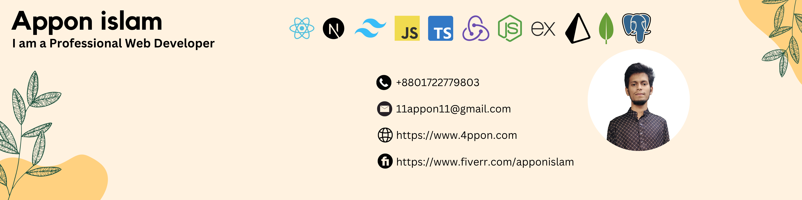

  

<h1 align="center">Hi 👋, I'm Appon Islam</h1>
<h3 align="center">
I build scalable full-stack web apps with React, Next.js & Node.js
</h3>

  

  

  

  

  

  

  

  

  

  

  

### 👨‍💻 About Me

- 🔭 I’m currently working on [SparkTech Agency](https://www.sparktech.agency/)

- 🌱 Pursuing **BSc in CSE** while building scalable real-world applications

- 👯 I’m looking to collaborate on exciting new full-stack projects.

- 🤝 I’m looking for help with new projects and ideas.

- 👨‍💻 All of my projects are available at [https://www.4ppon.com](https://www.4ppon.com)

- 📝 I regularly write articles on [https://www.4ppon.com](https://www.4ppon.com)

- 💬 Ask me about **HTML, CSS, JavaScript, TypeScript, Bootstrap, Tailwind CSS, React.js, Next.js, Redux, Firebase, OAuth, Node.js, Express.js, MongoDB, Mongoose, Prisma, SQL, PostgreSQL**

- 📫 How to reach me **11appon11@gmail.com**

- 📄 Know about my experiences [https://www.4ppon.com](https://www.4ppon.com)
- 🎯 Focused on building scalable full-stack applications with modern technologies
- ⚙️ Strong interest in backend architecture, APIs & real-time systems
- 📚 Continuously learning system design and advanced JavaScript concepts

  
  

### Languages and Tools:

  &ensp;
  &ensp;
  &ensp;
  &ensp;
  &ensp;
  &ensp;
  &ensp;
  &ensp;
  &ensp;
  &ensp;
  &ensp;
  &ensp;
  &ensp;
  &ensp;
  &ensp;
  &ensp;
  &ensp;
  &ensp;
  &ensp;
  &ensp;
&ensp;
&ensp;
&ensp;

 

<!-- Centered first item -->

### 📊 GitHub Stats

#### 🔥 Top Languages

  

 

#### 🔥 GitHub Overview

  

 

#### 📈 Activity & Contributions

  

#### 🔥 Contribution Streak

  

 

<!-- 

  

  

 -->

<!-- 

  

 -->

<!-- 

  

 -->

<!-- --- -->
