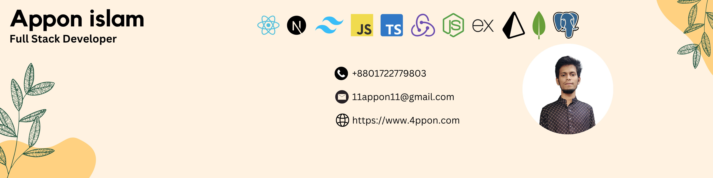

  

<h1 align="center">Hi 👋, I'm Appon Islam</h1>
<h3 align="center">I am a professional Full Stack Developer.</h3>

  

<!-- 
  
 -->
<!-- 
  
 -->

  

  

### Something About me:

- 🔭 I’m currently working on [SparkTech Agency](https://www.sparktech.agency/)

- 🌱 I’m currently learning **BSC in CSE**

- 👯 I’m looking to collaborate on exciting new full-stack projects.

- 🤝 I’m looking for help with new projects and ideas.

- 👨‍💻 All of my projects are available at [https://www.4ppon.com/](https://www.4ppon.com/)

- 📝 I regularly write articles on [https://www.4ppon.com/](https://www.4ppon.com/)

- 💬 Ask me about **HTML, CSS, JavaScript, TypeScript, Bootstrap, Tailwind CSS, React.js, Next.js, Redux, Firebase, OAuth, Node.js, Express.js, MongoDB, Mongoose, Prisma, SQL, PostgreSQL**

- 📫 How to reach me **11appon11@gmail.com**

- 📄 Know about my experiences [https://www.4ppon.com/](https://www.4ppon.com/)

<h3 align="left">Connect with me:</h3>

### Languages and Tools:

<!-- Tech Stack Icons -->
<!-- 

 -->

  &ensp;
  &ensp;
  &ensp;
  &ensp;
  &ensp;
  &ensp;
  &ensp;
  &ensp;
  &ensp;
  &ensp;
  &ensp;
  &ensp;
  &ensp;
  &ensp;
  &ensp;
  &ensp;
  &ensp;
  &ensp;
  &ensp;
  

 

<!-- Centered first item -->

### 📊 GitHub Stats

#### 🔥 Top Languages

  

 

#### 🔥 GitHub Overview

  

 

#### 🔥 Contribution Streak

  

 

---

<!-- Proudly created with GPRM ( https://gprm.itsvg.in ) -->
